===========
amreft-m4p
===========
:Author: Carlos Galdino <galdino@ifi.unicamp.br> and George Kontogiorgos <gekontogiorgos@gmail.com>
:Description: Set of python 3.7 scripts to control electronic devices via GPIB using KUSB-488A:USB to GPIB Interface Adapter

Instructions for the Impatient
-------------------------------
-Install keithley KUSB-488A GPIB/USB drive
-test1

Instructions for dummies
-------------------------

Installing and testing keithley GPIB/USB drive
***********************************************

Download, extract, and install the keithley GPIB drive. Here is the link to download: https://www.tek.com/accessory/gpib488/9-2-0, or you may use the zip folder Keithley_GPIB488v92.zip from the projects folder.

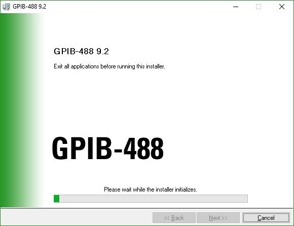

Restart the computer, connect the Keithley USB/GPIB converter to the computer and Keithley device and open the program TRTEST.

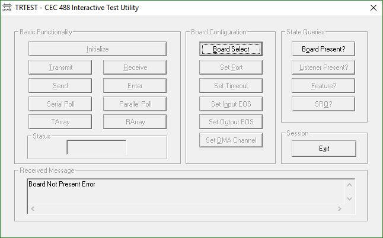

If the converter (or any other board is detected) the TRTEST buttons are enabled

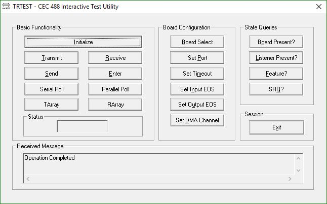

Click on Initialize and type the computer GPIB address, which we will select as 21.

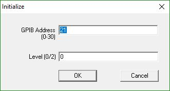

To send a command, check the GPIB address in the Keithley device (In this case it is 03) and click on Send. Send the command *idn?

Note the REM (from remote) lights up at the Keithley screen. Also note the LST (from listening) lights up as an indicative that the device is waiting from the computer the read a response.

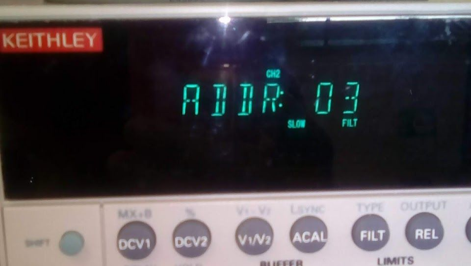
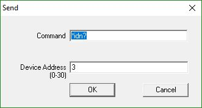

This command asks what is the device name. The device will answer to the question. To check its answer click on Enter and type the device address, then OK.

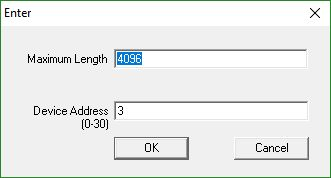
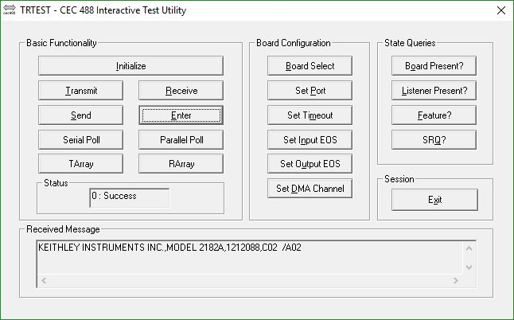

Basic communication scripts
***********************************************

WARNING: This section intends to show how to compile (and modify) the C scripts that enables the GPIB communication.  You may skip to the next section if the bin folder has these three files: init.exe, receiveGpib.exe, and sendGpib.exe.

The core communication between the computer and the device is easier if done in C. Download and install MinGW (http://www.mingw.org/), which is a minimalist development environment for native Microsoft Windows applications. Instal it at C:/MinGW

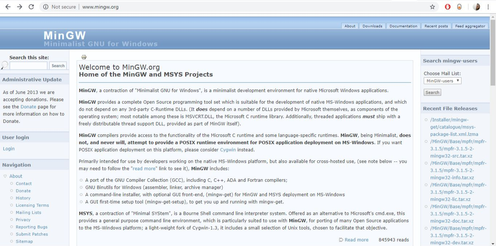
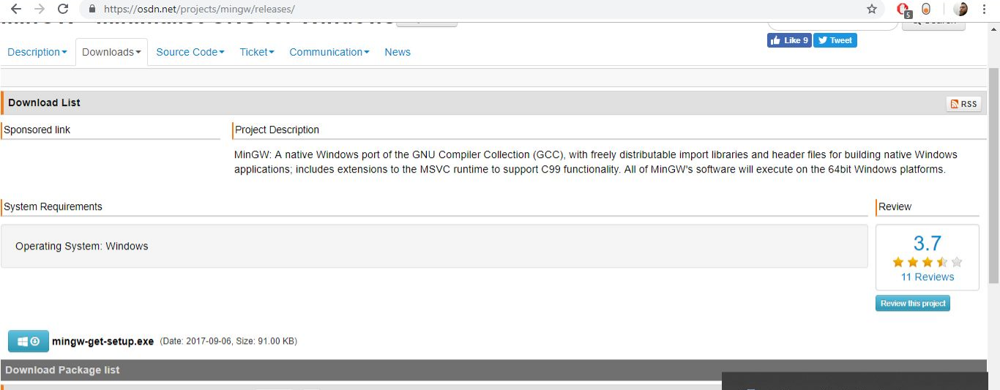
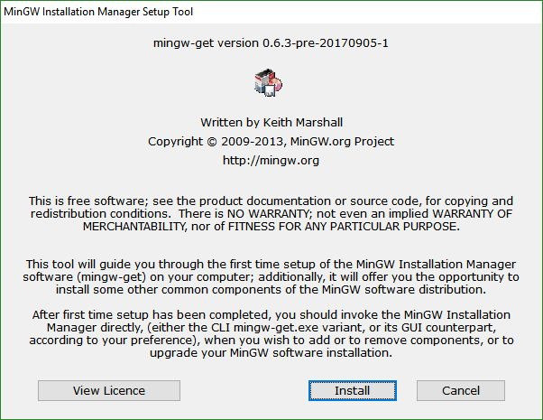
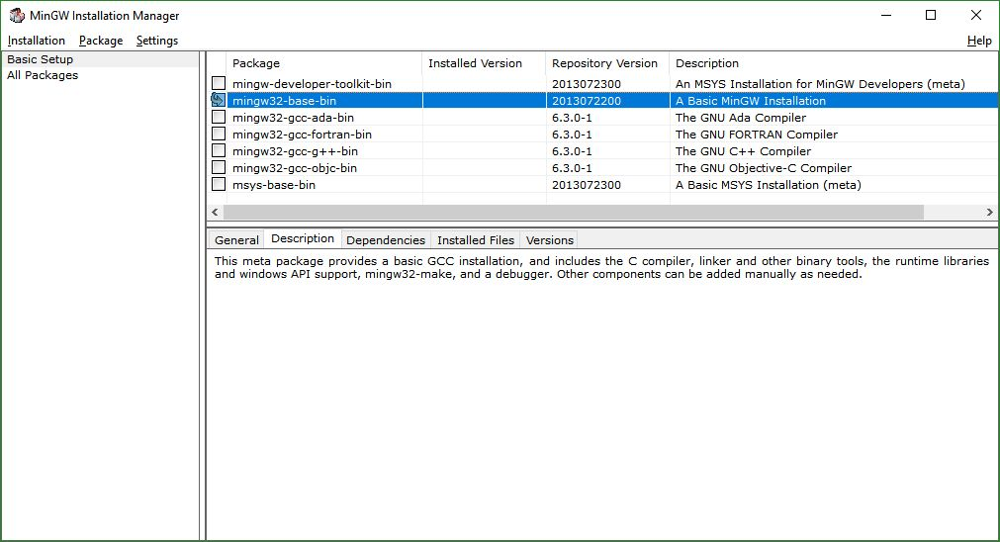
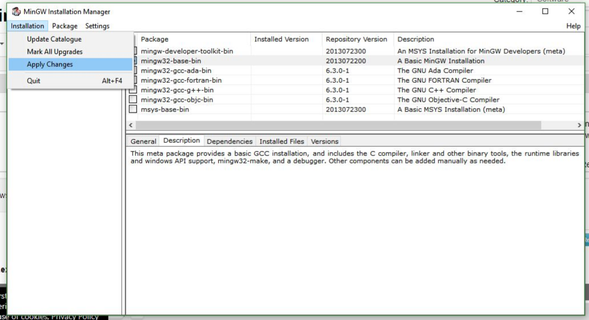

After installation put MinGW/bin to the windows PATH. This makes possible to run MinGW commands from the prompt from any folder. Open the prompt and type gcc, if a fatal error occur, then the installation was successful.

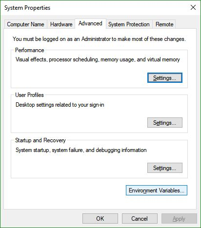
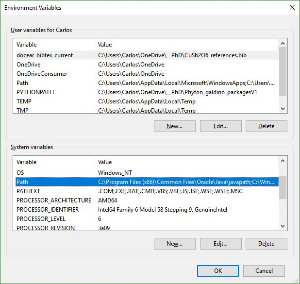
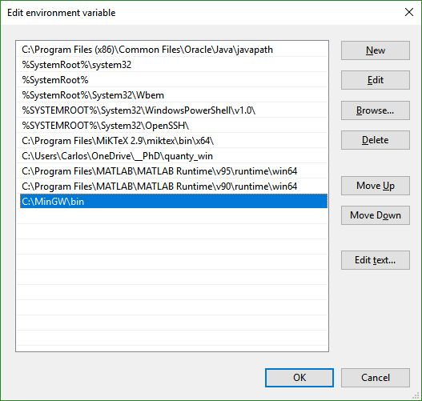
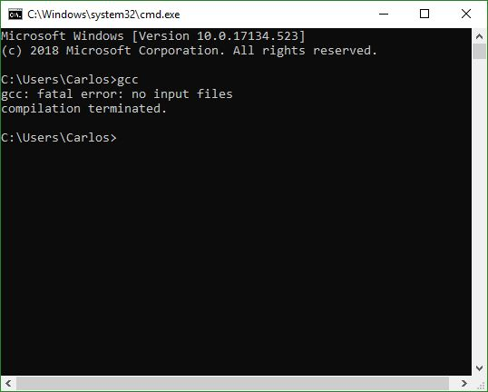

There are 3 C scripts that must be compiled: init.c, receiveGpib.c, and sendGpib.c. If it is necessary to modify this C scripts I recommend downloading the Notepad++, which is just a text editor with text highlight functionality. However, any text editor will do the job.

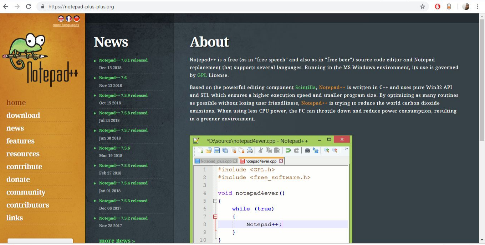

To compile the C scripts open the prompt  and go to the folder where the scripts are located (src folder). Then type the commands:

gcc -Wall init.c ../lib/ieee_32m.lib -o ../bin/init.exe
gcc -Wall receiveGpib.c ../lib/ieee_32m.lib -o ../bin/receiveGpib.exe
gcc -Wall sendGpib.c ../lib/ieee_32m.lib -o ../bin/sendGpib.exe

If everything goes okay you must have three exe files in the bin folder.

Python gpib functions
***********************************************

The core python script is galdinoFunctions_gpib_V1.py. In this script we got three functions, which are the C functions ‘equivalent’ in python. : 

init_gpib()
Configures the computer to communicate via gpib with address 21. If another computer is added to the network another C script must be written with a different address.

send_GPIB(message, device_address, bin_path)
Sends a string (message) to the device_address. The bin_path is the directory path where the exe files are, like: bin_path = r'D:\amreft-m4p\amreft-m4p_V1_galdino\bin'

receive_GPIB(device_address, bin_path)
Receives a string (message) from the device_address. The bin_path is the directory path where the exe files are, like: bin_path = r'D:\amreft-m4p\amreft-m4p_V1_galdino\bin'

Import galdinoFunctions_gpib_V1.py whenever you need these functions by using,

.. highlight:: python

from galdinoFunctions_gpib_V1.py import *

Python gpib functions
***********************************************

Before using the keithley 2182A nanovoltmeter remember to adjust FILTER, REL, and RATE. I did not implement that on the script because I think it is easier to set these by hand. If necessary, we may implement these on a future version of the code. 

Note that bin_path and address_2182A variables must be defined already. For example:
address_2182A = 3
bin_path = r'D:\amreft-m4p\amreft-m4p_V1_galdino\bin'
The important functions are: 
v()
Reads a voltage value in Volts.

send_GPIB('*RST', address_2182A, bin_path)
Restore GPIB and remote options to default. This is necessary to change a few configurations, e.g. triggering mode, that works better in remote mode.

